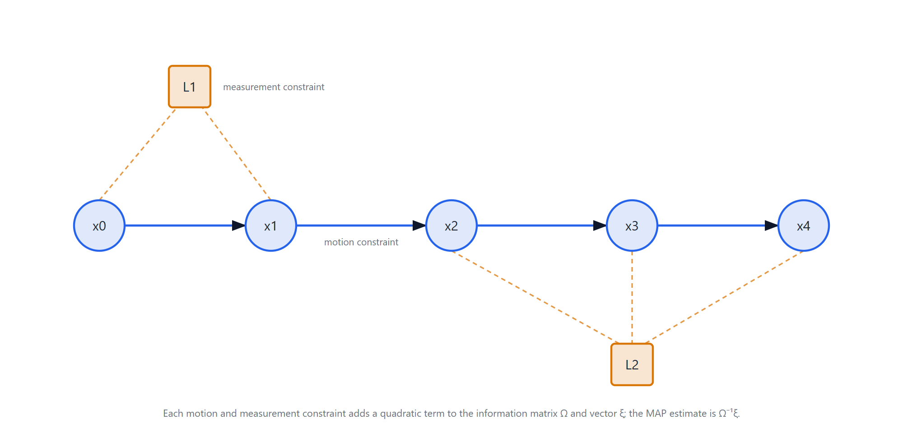
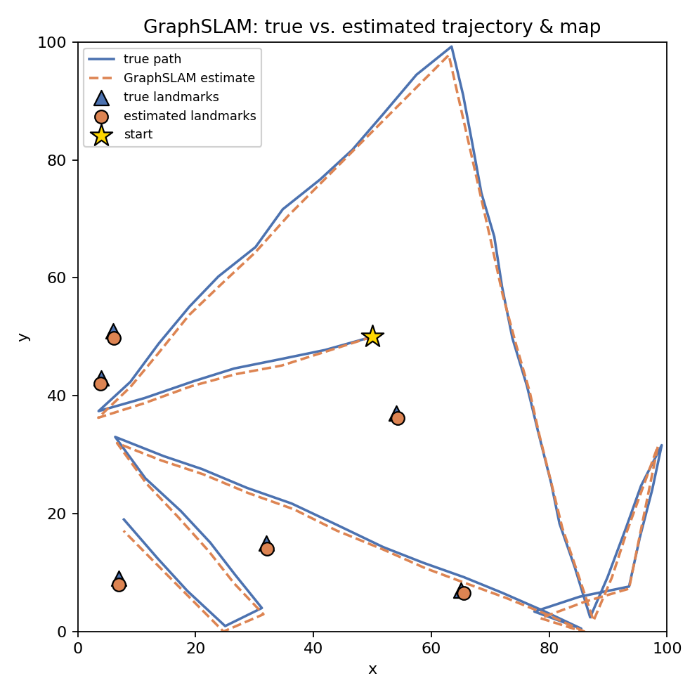
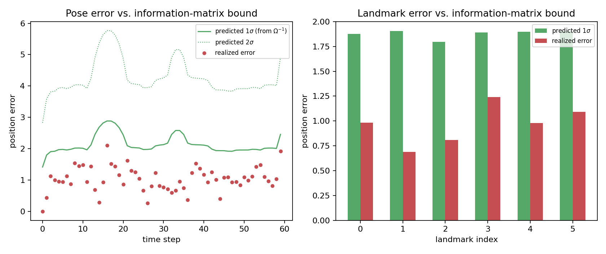

# Simultaneous Localization and Mapping (SLAM)

## Overview
A from-scratch implementation of **GraphSLAM** for a simulated robot moving in a 2D grid world:
build an information-form constraint matrix from motion and landmark-range measurements, then
solve once for the entire trajectory and map via a single MAP (maximum a posteriori) estimate.
Originally a project for Udacity's Computer Vision Nanodegree — the pieces implemented here
(the noisy sensing model and the constraint-matrix/solve) are graph-based batch estimation, not
computer vision; see [What this is / isn't](#what-this-is--isnt) below.

## How it works

- **World**: the robot moves in a straight line in a random direction inside a square grid
  until it nears a wall, then picks a new direction. It senses the `(dx, dy)` offset to any
  landmark within range, both corrupted by additive noise (`robot_class.py`).
- **Estimator — GraphSLAM**: every motion step and every landmark observation adds a quadratic
  penalty term to an information matrix `Omega` and information vector `xi`
  (`initialize_constraints`, `slam` in `3. Landmark Detection and Tracking.ipynb`). After all
  data is collected, the full trajectory and map are recovered in one shot:
  `mu = inv(Omega) @ xi`.

## Results

A 60-step run, 6 landmarks, `world_size=100`, `motion_noise = measurement_noise = 1.0`:

| | value |
|---|---|
| mean pose error | 1.03 (world units) |
| mean landmark error | 0.97 (world units) |
| estimates within predicted 1-sigma | 66 / 66 (100%) |

Every pose and landmark estimate in this run landed inside the uncertainty the information
matrix itself predicted — the estimator's self-reported confidence matched its actual accuracy.
See the "Beyond the assignment" section of `3. Landmark Detection and Tracking.ipynb` for the code.

## Connection to my own localization research

My PhD work is this same question asked one step removed. ["Positioning for Visible Light
Communication System Exploiting Multipath Reflections"](https://arxiv.org/abs/1707.08203) (ICC
2017) localizes a receiver from multipath features in an indoor optical channel; ["Performance
Limits for Fingerprinting-Based Indoor Optical Communication Positioning Systems"](https://arxiv.org/abs/1804.09360)
(IEEE Photonics Journal, 2020) derives the Cramer-Rao lower bound on how accurate that kind of
estimate can ever be, given the same channel model. Both are **single-shot** problems: one
measurement (or one channel snapshot), one location, one bound.

GraphSLAM is the same idea taken **sequential**. Instead of bounding one estimate from one
measurement, it accumulates information from many motion and measurement constraints into a
single information matrix `Omega`, then inverts it once for the whole trajectory. `Omega` is a
Fisher information matrix in exactly the sense the CRLB derivation uses one — it is just built
incrementally, over time steps, instead of for a single measurement. The uncertainty check above
(`inv(Omega)`'s diagonal vs. the realized error) is the same fundamental-limits question — *is the
estimator's own reported confidence honest?* — asked of a dynamic estimator instead of a static
one.

## What this is / isn't

- **Is**: a working GraphSLAM implementation — information-form batch MAP estimation — with a
  from-scratch noisy sensing model, validated against both ground truth and its own
  information-matrix uncertainty.
- **Isn't**: a Kalman filter (no recursive predict/update loop or time-varying covariance
  propagation), real-time (it's a single batch solve over the whole trajectory, not an online
  per-step estimate), or computer vision (no images or camera model — a synthetic landmark-range
  simulation).

## Project structure

1. **`Robot Moving and Sensing.ipynb`**: localizes a robot in a 2D grid world using only noisy
   motion and sensing data — the groundwork for SLAM. Defines the robot class's movement and
   landmark-sensing behavior, including noise.
2. **`Omega and Xi, Constraints.ipynb`**: introduces the GraphSLAM information matrix (`Omega`)
   and information vector (`xi`) on a small example, and how motion/measurement constraints fill
   them in, before extending to the full 2D case.
3. **`Landmark Detection and Tracking.ipynb`**: the full implementation — `initialize_constraints`
   and `slam` build `Omega`/`xi` from a whole run's worth of motion and measurement data, solve
   for `mu = inv(Omega) @ xi`, and validate the result against ground truth and (in the "Beyond
   the assignment" section) against the information matrix's own predicted uncertainty.
4. **`helpers.py`**: `display_world` (grid visualization) and `make_data` (drives the robot
   through a randomized run and collects the motion/measurement data `slam` consumes).
5. **`robot_class.py`**: the 2D robot — moves in a straight line until near a wall, then senses
   `(dx, dy)` to nearby landmarks (deliberately not range/bearing, to keep the estimator's math
   simple).

## Getting started
1. Clone the repository.
2. Open `1. Robot Moving and Sensing.ipynb` first, then `2. Omega and Xi, Constraints.ipynb`,
   then `3. Landmark Detection and Tracking.ipynb` (each builds on the last).
3. Or open directly in Colab via the badge above.

## Troubleshooting
Please let me know if you run into any problems running the code.

## Acknowledgments
This project began as part of Udacity's Computer Vision Nanodegree program; the GraphSLAM
implementation, the accuracy validation, and the information-matrix uncertainty check are my own
extensions beyond the original assignment. Feel free to explore the code — questions and feedback
welcome.
